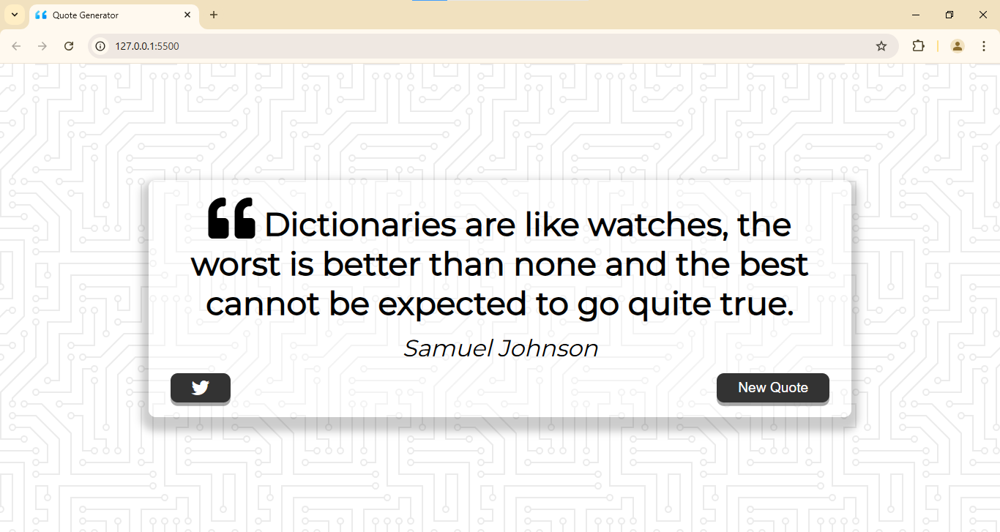

##

# Quote Generator

This is a web-based Quote Generator application that displays inspirational quotes to users. It fetches quotes from an API or a local dataset and allows users to share their favorite quotes on Twitter.

## Features

- Displays a random quote from an API or local collection.
- Differentiates between long and short quotes for better visual presentation.
- Allows users to share quotes directly to Twitter.
- Includes a loading animation for a better user experience.

## Preview



## Hosted Link

Check out the live application here: [Quote Generator](https://neendudev.github.io/Quote-Generator/)

## Technologies Used

- **HTML5**: Structure of the application.
- **CSS3**: Styling and responsive design.
- **JavaScript**: Logic for fetching and displaying quotes, handling user interactions.
- **Font Awesome**: For beautiful icons used in buttons and design elements.

## Installation

1. Clone this repository:
   ```bash
   git clone https://github.com/your-username/quote-generator.git
   ```
2. Navigate to the project directory:
   ```bash
   cd quote-generator
   ```
3. Open the `index.html` file in a browser.

## Usage

- Click the **New Quote** button to load a new random quote.
- Click the **Twitter** button to share the current quote on Twitter.

## Project Files

- **index.html**: The main HTML structure of the app.
- **style.css**: Contains all the styling rules for the app.
- **script.js**: Handles fetching quotes and user interactions.
- **quotes.js**: Contains a local collection of quotes for offline use.
- **favicon.png**: The app's favicon.

## License

This project is licensed under the MIT License - see the [LICENSE](/LICENCE.txt) file for details.

## Acknowledgments

- [Jacinto Design](https://jacintodesign.github.io/quotes-api/) for the free quote API.
- [Font Awesome](https://fontawesome.com/) for the icons.

---
